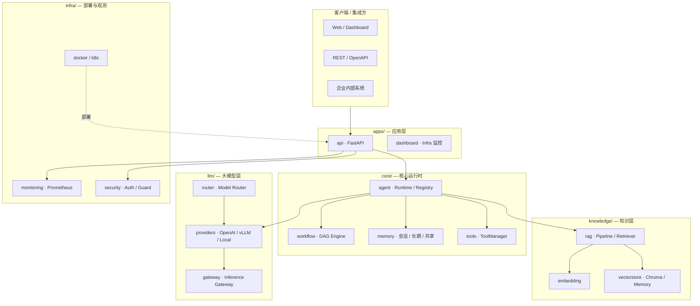

# Enterprise AI Platform

<p align="center">
  <strong>企业级大模型应用平台</strong><br/>
  从 Agent 运行时到 RAG / MCP / Multi-Agent，再到 vLLM 自托管与生产部署
</p>

<p align="center">
  <a href="https://github.com/LZZZQ-Lab/enterprise-ai-agent/actions/workflows/test.yml"></a>
  
  
  
  
</p>

<p align="center">
  <a href="#项目介绍">项目介绍</a> ·
  <a href="#核心能力">核心能力</a> ·
  <a href="#系统架构">系统架构</a> ·
  <a href="#快速启动">快速启动</a> ·
  <a href="#demo-展示">Demo</a> ·
  <a href="#技术路线">技术路线</a> ·
  <a href="#roadmap">Roadmap</a> ·
  <a href="docs/STRUCTURE.md">目录结构</a> ·
  <a href="docs/README.md">文档索引</a> ·
  <a href="docs/DEVELOPMENT.md">开发指南</a>
</p>

---

## 项目介绍

**Enterprise AI Platform** 是一套面向企业生产环境的 **企业级大模型应用平台**。

它将 Agent 运行时、知识检索、工具调用、工作流编排与 LLM 基础设施封装为可复用模块，帮助团队：

| 受众 | 价值 |
|------|------|
| **开发者** | 开箱即用的 Agent Framework、RAG Pipeline、MCP 集成；统一 `Settings` + `.env` 配置；248+ pytest 保障质量 |
| **招聘 / 面试工程师** | 完整 Phase 1–8 工程化实践：Benchmark · 压测 · CI/CD · 安全 · 结构化日志 · v1.0.0 Release |
| **企业用户** | OpenAI 兼容 API / 自托管 vLLM 双模式；Docker / K8s 部署；API 认证 · Prompt 注入防护 · 危险操作审批 |

平台采用 **Canonical 模块 + Legacy 兼容** 的目录设计（Task 9.1）：新代码推荐使用 `core/`、`llm/`、`knowledge/`、`apps/`，`app.*` 路径继续有效。详见 [docs/STRUCTURE.md](docs/STRUCTURE.md)。

---

## 核心能力

| 能力 | 说明 | 关键路径 |
|------|------|----------|
| ✓ **Agent Runtime** | 注册 · 工厂 · 调度 · Agent Loop（Plan + ReAct） | `core/agent` · `app/agents/` |
| ✓ **RAG** | 文档上传 · 分块 · Embedding · 向量检索 · 引用溯源 | `knowledge/rag` · `/api/v1/knowledge` |
| ✓ **MCP** | Model Context Protocol 客户端与 Tool 适配 | `app/mcp/` |
| ✓ **Multi-Agent** | Manager 动态规划 · 多角色协作 · 共享 Memory | `app/agents/software_team/` |
| ✓ **vLLM** | 自托管推理 · OpenAI 兼容 API · GPU 调优 | `llm/providers` · [vLLM 部署](docs/vllm_deployment.md) |
| ✓ **Workflow** | 可配置 DAG · Agent / Tool / 人工审批节点 | `core/workflow` · `app/workflow/` |
| ✓ **AI Software Team** | PM → Product → Architecture → Dev → Review → Test → DevOps 全链路 | [software_team.md](docs/software_team.md) |

**配套基础设施（Production Ready v1.0.0）**

- **Inference Gateway** — 统一推理入口 · Token 统计 · 多后端路由
- **Model Registry / Router** — 模型元数据 · 按任务自动选模
- **Infra Dashboard** — GPU · 缓存 · Gateway · Agent 调度指标
- **Security** — API 认证 · Secret 管理 · Prompt Injection 防护 · 危险 Tool 审批
- **Observability** — 结构化 JSON 日志 · Prometheus `/metrics` · Agent Trace

---

## 系统架构

### 平台分层



### 一次对话的调用链

```text
POST /api/v1/chat
  → ChatService
  → AgentRuntime.run(AgentTask)
  → ChatAgent.run(AgentContext)
  → PromptBuilder.build()          # System + Memory + Tools + User
  → AgentExecutor (Agent Loop)     # LLM ↔ Tool 循环
  → BaseLLM.chat()                 # MODEL_PROVIDER 选择后端
  → AgentResult
```

### 仓库结构（精简）

```text
enterprise-ai-agent/
├── apps/              api · dashboard
├── core/              agent · workflow · memory · tools
├── llm/               providers · router · gateway
├── knowledge/         rag · embedding · vectorstore
├── infra/             docker · deploy · k8s · monitoring
├── backend/           app/ 实现 · applications/ 应用 · scripts/
├── tests/             unit · integration · e2e
├── examples/          独立 Demo
├── deploy/            兼容入口（→ infra/deploy）
└── docs/              架构 · API · 部署 · [文档索引](docs/README.md)
```

---

## 快速启动

### 环境要求

- **Python 3.11+**
- **Git**
- LLM 接入：**OpenAI 兼容 API Key** 或 **本地 vLLM**（可选 GPU）
- Node.js 18+（Dashboard 前端，可选）

### 方式 A：本地开发（推荐上手）

```powershell
# 1. 克隆与依赖
git clone https://github.com/LZZZQ-Lab/enterprise-ai-agent.git
cd enterprise-ai-agent/backend
copy .env.example .env
# 编辑 .env：API_KEY、MODEL_NAME、MODEL_PROVIDER=openai

pip install -r requirements.txt

# 2. 启动 API
python -m uvicorn app.main:app --host 0.0.0.0 --port 8001
```

| 入口 | URL |
|------|-----|
| Swagger | http://localhost:8001/docs |
| 健康检查 | http://localhost:8001/health |
| 对话 | `POST /api/v1/chat` |
| Infra Dashboard | http://localhost:8001/infra/dashboard/demo |

### 方式 B：Docker（无需 GPU）

```bash
# 仓库根目录 — 仅 API，适合 Swagger / 知识助手 Demo
docker compose -f infra/docker/docker-compose.api-only.yml up --build
```

### 方式 C：vLLM 自托管

```env
MODEL_PROVIDER=vllm
VLLM_ENDPOINT=http://127.0.0.1:8000/v1
MODEL_NAME=Qwen2.5
VLLM_MAX_TOKENS=256
```

启动 vLLM 与联调步骤见 **[docs/vllm_deployment.md](docs/vllm_deployment.md)**。

### 运行测试

```powershell
cd backend
pytest -m "not integration"
# CI 同款报告
bash scripts/run_tests.sh
```

### 生产部署

| 场景 | 文档 |
|------|------|
| 轻量栈（API + vLLM） | [docs/deployment.md](docs/deployment.md) |
| 生产全栈（Nginx + Chroma + Redis） | [docs/production_deploy.md](docs/production_deploy.md) |
| Kubernetes | [infra/k8s/README.md](infra/k8s/README.md) |

---

## Demo 展示

### 脚本 Demo 体系（Task 9.4，推荐离线体验）

**无需 GPU / API Key / Docker**，在仓库根目录一键运行：

```powershell
python examples/demo_01_chat.py          # 基础 LLM
python examples/demo_02_rag.py           # 知识库问答
python examples/demo_03_agent.py         # Agent Tool Calling
python examples/demo_04_workflow.py      # Workflow
python examples/demo_05_software_team.py # AI 软件团队
python examples/demo_06_infra.py         # 模型路由 + Gateway

# 全部 Mock Demo
powershell -File examples/run_all_demos.ps1
```

完整说明见 **[examples/README.md](examples/README.md)**。

### 精选 Demo

| Demo | 说明 | 启动命令 |
|------|------|----------|
| **企业知识助手** | 上传文档 → RAG 检索 → Agent 问答 | [examples/enterprise_knowledge_assistant/](examples/enterprise_knowledge_assistant/README.md) |
| **AI 软件团队（全链路）** | 「开发用户管理系统」→ PM 规划 → 多 Agent 协作 → 代码 / 测试 / 部署报告 | `python -m applications.software_team.run_full_team_demo` |
| **Workflow 人工审批** | DAG 工作流 + Human-in-the-loop | `python -m applications.workflow.run_human_approval_demo` |
| **MCP 生态** | MCP 客户端 + Tool 适配演示 | `python -m applications.mcp_demo.run_demo` |
| **具身智能** | Vision + Robot Tool 扩展 | `python -m applications.embodied_demo.demo` |
| **Infra Dashboard** | GPU / Gateway / 缓存 / 调度指标 | 启动 API 后访问 `/infra/dashboard/demo` |

### 企业知识助手（Quick Start）

```powershell
cd backend
python -m uvicorn app.main:app --port 8001

# 上传样例文档
curl -X POST "http://localhost:8001/api/v1/knowledge/documents" ^
  -F "file=@../examples/enterprise_knowledge_assistant/sample_docs/platform_intro.md"

# 提问
curl -X POST "http://localhost:8001/api/v1/knowledge/ask" ^
  -H "Content-Type: application/json" ^
  -d "{\"session_id\":\"demo\",\"question\":\"平台如何检索企业知识？\"}"
```

### AI 软件团队（Quick Start）

```powershell
cd backend
python -m applications.software_team.run_full_team_demo
# 运行记录：backend/project_runs/{run_id}/
# 含 tasks.json · reports/ · workspace/
```

单角色 Demo（Product / Developer / Tester / DevOps 等）、Tool 设计与 Runtime 接入见 **[docs/software_team.md](docs/software_team.md)**。

---

## 技术路线

平台按 **渐进式 Phase** 演进，每一阶段可独立运行、可测试、可演示：

```text
Phase 1  Platform Foundation     Agent Runtime · LLM Provider · Prompt · Settings · pytest
Phase 2  Inference & Deploy      vLLM 部署/Provider · Docker · 性能 Benchmark
Phase 3  Enterprise Capabilities RAG · MCP · Multi-Agent · 企业知识助手 API
Phase 4  Production Infra       量化 · vLLM 调优 · Prometheus · 生产 Compose
Phase 5  AI Software Team       PM→DevOps 平台 Agent · 全链路 Demo · project_runs/
Phase 6  Workflow Engine        DAG · 条件分支 · 人工审批节点
Phase 7  AI Infra               Gateway · Model Registry/Router · GPU · Cache · Dashboard
Phase 8  Production Engineering 248 tests · Benchmark · Locust · CI/CD · Security · v1.0.0
Phase 9  Open Source Ready      目录结构 · README · 架构文档 · Demo 体系 · 开源规范
```

**技术栈**

| 层级 | 选型 |
|------|------|
| 语言 / 框架 | Python 3.11 · FastAPI · Uvicorn · Pydantic Settings |
| LLM | OpenAI SDK（兼容 DeepSeek / Azure）· vLLM OpenAI API |
| 知识库 | Embedding Factory · Chroma / InMemory VectorStore |
| 协议 | MCP（Model Context Protocol） |
| 前端 | Vue 3 · Vite · Element Plus |
| 部署 | Docker Compose · Kubernetes · Nginx |
| 质量 | pytest（unit / integration / e2e）· ruff · GitHub Actions |

---

## Roadmap

### 已完成（v1.0.0）

- [x] Agent Runtime · Tool Calling · Memory · Prompt 工程
- [x] RAG Pipeline · 企业知识助手 REST API
- [x] MCP 客户端与 Tool 适配
- [x] Multi-Agent · AI 软件团队全链路
- [x] vLLM Provider · Docker / K8s 部署
- [x] Workflow DAG · 人工审批
- [x] Inference Gateway · Model Registry / Router
- [x] CI/CD · Security · 结构化日志 · Benchmark / 压测
- [x] 模块化目录结构（Task 9.1）
- [x] Phase 9 开源规范（Task 9.6）— Issue/PR 模板 · CoC · SECURITY · Dependabot

### 进行中 / 规划

| 优先级 | 项 | 说明 |
|--------|-----|------|
| P1 | **Local Provider 生产化** | 进程内 Qwen / Transformers 推理 |
| P1 | **RAG 生产增强** | 真实 Embedding 默认 · Chroma 持久化 · 混合检索 |
| P2 | **Demo 统一入口** | `scripts/run_demo.sh` · 交互式 Demo 选择器 |
| P2 | **多语言 README** | English README · 架构白皮书 |
| P3 | **Plugin Marketplace** | 可插拔 Tool / Agent 插件分发 |
| P3 | **Fine-tune 流水线** | LoRA 训练 · 评估 · 模型注册联动 |

版本与变更：[CHANGELOG.md](CHANGELOG.md) · 发布流程：[RELEASE.md](RELEASE.md) · 当前版本 **[1.0.0](VERSION)**

---

## 文档索引

| 文档 | 说明 |
|------|------|
| [docs/STRUCTURE.md](docs/STRUCTURE.md) | 目录结构与 Canonical / Legacy 映射 |
| [docs/architecture.md](docs/architecture.md) | **系统架构** — Runtime · Workflow · RAG · 部署 |
| [docs/blog/](docs/blog/) | **技术博客** — Agent · vLLM · RAG · Multi-Agent · Software Team · LLM Infra |
| [docs/interview/](docs/interview/) | **面试材料** — 自述 · 架构问答 · 技术深度 |
| [docs/software_team.md](docs/software_team.md) | AI 软件团队 Agent · Tool · Demo |
| [docs/API.md](docs/API.md) | REST API · OpenAPI 导出 |
| [docs/DEVELOPMENT.md](docs/DEVELOPMENT.md) | 开发环境 · 测试 · 发布 |
| [docs/vllm_deployment.md](docs/vllm_deployment.md) | vLLM 安装与联调 |
| [docs/performance.md](docs/performance.md) | LLM Benchmark 报告 |
| [CONTRIBUTING.md](CONTRIBUTING.md) | 贡献指南 |
| [CODE_OF_CONDUCT.md](CODE_OF_CONDUCT.md) | 行为准则 |
| [SECURITY.md](SECURITY.md) | 安全策略与漏洞报告 |

---

## 参与贡献

欢迎 Issue / PR / Discussion：

- [提交 Bug 或功能建议](https://github.com/LZZZQ-Lab/enterprise-ai-agent/issues/new/choose)
- 阅读 [CONTRIBUTING.md](CONTRIBUTING.md) 了解开发与 CI 要求
- 遵守 [CODE_OF_CONDUCT.md](CODE_OF_CONDUCT.md)
- 安全漏洞请见 [SECURITY.md](SECURITY.md)（勿公开 Issue）

---

## License

本项目采用 **[MIT License](LICENSE)** 开源。

```text
Copyright (c) 2026 Enterprise AI Platform contributors
```

企业内部分发或闭源二次开发时，可替换为自有协议；保留第三方依赖的原始 License。

---

<p align="center">
  <sub><strong>Enterprise AI Platform</strong> — Build enterprise-grade LLM applications, not boilerplate.</sub>
</p>
