# Enterprise AI Platform — 系统架构

> **Enterprise AI Platform** 企业级大模型应用平台的系统设计说明。  
> 涵盖 Agent Runtime、Workflow、LLM 基础设施、RAG、模型Serving 与部署拓扑。  
> 目录结构见 [STRUCTURE.md](./STRUCTURE.md)；AI 软件团队应用层见 [software_team.md](./software_team.md)。

---

## 1. 总体架构

平台采用 **分层 + 模块化** 设计：上层应用通过 Canonical 包（`apps/`、`core/`、`llm/`、`knowledge/`）访问能力，实现位于 `backend/app/`，Legacy 路径 `app.*` 保持兼容。

### 1.1 逻辑分层

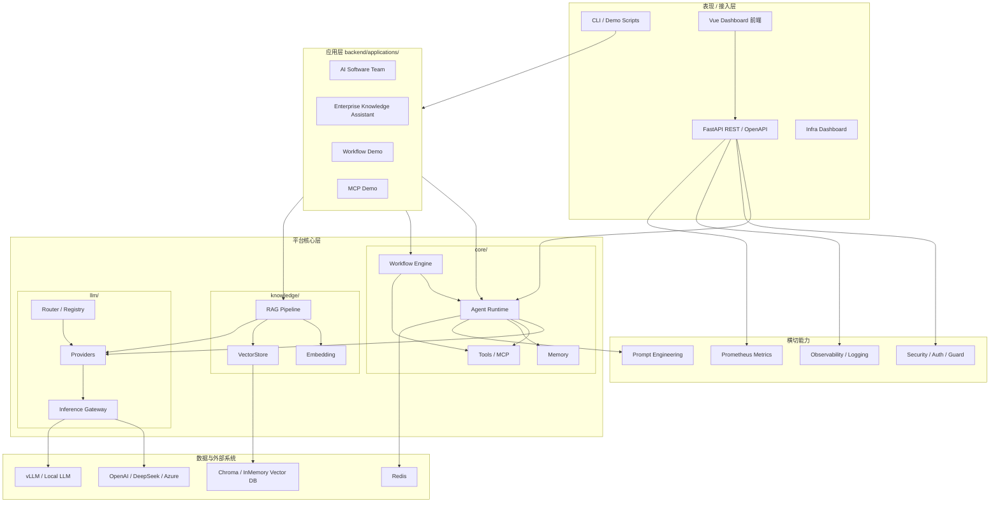

### 1.2 模块依赖原则

| 原则 | 说明 |
|------|------|
| **单向依赖** | 应用层 → 平台核心 → LLM/知识层；核心不依赖具体应用 |
| **配置驱动** | 统一 `Settings` + `.env`；`AgentConfig.from_env()` 注入运行时 |
| **Provider 抽象** | Agent 只依赖 `BaseLLM`，通过 Factory 切换 OpenAI / vLLM / Gateway |
| **可测试** | 248+ pytest；Mock LLM / Fake Embedding 支持离线验证 |
| **渐进迁移** | Canonical 包为 facade，实现仍在 `backend/app/`，零破坏升级 |

### 1.3 代码映射

| 架构层 | Canonical 路径 | 实现路径 |
|--------|----------------|----------|
| API 入口 | `apps/api` | `backend/app/main.py` |
| Agent | `core/agent` | `backend/app/agents/` |
| Workflow | `core/workflow` | `backend/app/workflow/` |
| Memory | `core/memory` | `backend/app/memory/` |
| Tools | `core/tools` | `backend/app/tools/` · `backend/app/mcp/` |
| RAG | `knowledge/rag` | `backend/app/rag/` |
| LLM | `llm/providers` | `backend/app/llm/` |
| Gateway | `llm/gateway` | `backend/app/gateway/` |
| Router | `llm/router` | `backend/app/router/` · `backend/app/model_registry/` |

---

## 2. Agent Runtime

Agent Runtime 是平台的 **执行内核**：接收任务、创建 Agent 实例、驱动 Prompt 构建与 Agent Loop，返回结构化结果。

### 2.1 组件关系

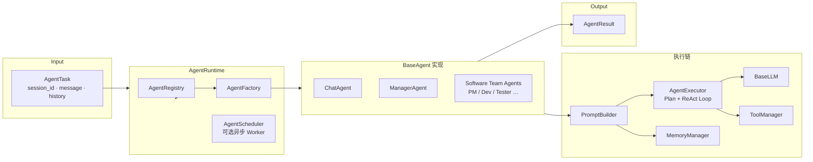

### 2.2 核心类型

| 组件 | 模块 | 职责 |
|------|------|------|
| `AgentTask` | `app/agents/runtime.py` | 任务描述：会话 ID、用户消息、历史、元数据 |
| `AgentRuntime` | `app/agents/runtime.py` | 注册表 + 工厂 + 调度；`run()` / `execute_task()` |
| `AgentRegistry` | `app/agents/registry.py` | Agent 类型注册与发现（`chat`、`developer` 等） |
| `AgentFactory` | `app/agents/factory.py` | 按名称与 `AgentConfig` 实例化 Agent |
| `AgentContext` / `AgentResult` | `app/agents/types.py` | 单次运行上下文与结果 |
| `AgentExecutor` | `app/agents/executor/` | LLM ↔ Tool 循环；Planner · Observation · Tracer |
| `ChatAgent` | `app/agents/chat_agent.py` | 默认对话 Agent（Plan + ReAct） |
| `PromptBuilder` | `app/prompts/builder.py` | System + Memory + Tools + User 消息组装 |

### 2.3 Agent Loop 时序

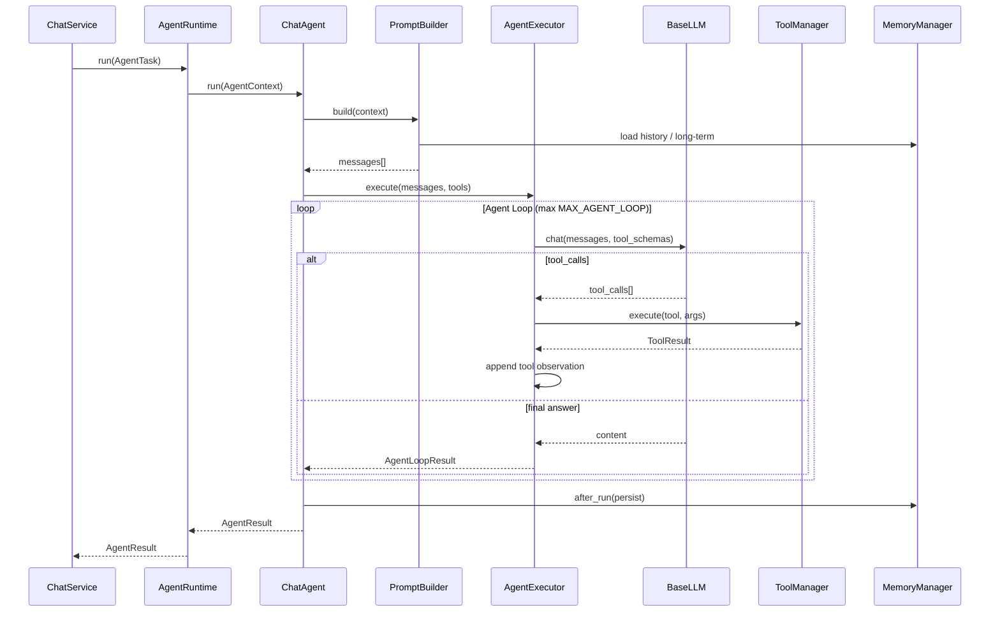

### 2.4 Multi-Agent 扩展

Software Team 等多 Agent 场景在 `app/agents/software_team/` 注册独立角色 Agent，由 **ManagerAgent** 动态规划任务列表，经同一 `AgentRuntime` 调度各专家 Agent，共享 `shared_context` 与 `ProjectMemory`。

---

## 3. Workflow Engine

Workflow Engine 提供 **可配置 DAG** 编排：支持 Agent 节点、Tool 节点、条件分支与人工审批（Human-in-the-loop），通过 `AgentRuntime` 调用 Agent，不修改 Runtime 本身。

### 3.1 引擎结构

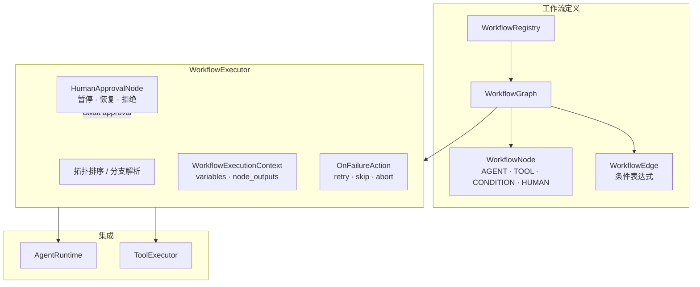

### 3.2 节点类型

| `NodeType` | 行为 |
|------------|------|
| `AGENT` | 构造 `AgentTask`，调用 `AgentRuntime.run()` |
| `TOOL` | 经 `ToolExecutor` 执行注册 Tool |
| `CONDITION` | 评估边表达式，选择下一分支 |
| `HUMAN` | 暂停工作流，等待人工审批 API 恢复 |

### 3.3 状态机

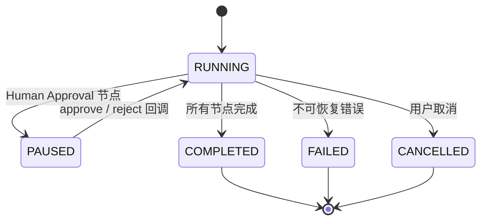

关键模块：`app/workflow/graph.py` · `executor.py` · `human_node.py` · `registry.py`

---

## 4. LLM Infrastructure

LLM 基础设施层负责 **模型接入、路由、网关与可观测性**，对上层 Agent 暴露统一的 `BaseLLM` 接口。

### 4.1 基础设施全景

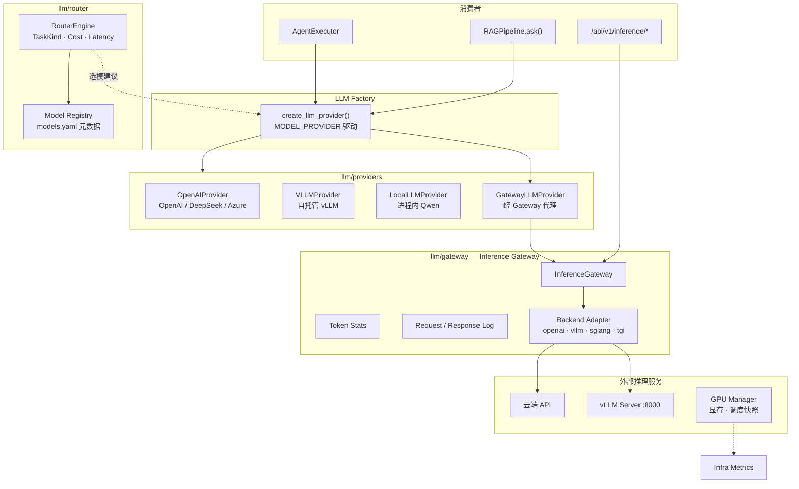

### 4.2 Provider 矩阵

| Provider | 配置 | 场景 |
|----------|------|------|
| `openai` | `API_KEY` · `OPENAI_BASE_URL` · `MODEL_NAME` | 云端 API、DeepSeek 等兼容接口 |
| `vllm` | `VLLM_ENDPOINT` · `VLLM_MAX_TOKENS` | 企业自托管 GPU 推理 |
| `local` | `MODEL_NAME`（Qwen 等） | 开发 / 离线 Transformers |
| `gateway` | `ENABLE_INFERENCE_GATEWAY=true` | 统一网关、Token 统计、多后端 |

### 4.3 Model Registry & Router

- **Model Registry**（`app/model_registry/`）：YAML 驱动模型元数据（Vendor · Cost · Context Window · Capability Tags）
- **RouterEngine**（`app/router/engine.py`）：根据 `TaskKind`（CHAT / CODE / RAG / LONG_CONTEXT 等）、Cost、Latency 策略从 Registry 选择最优模型

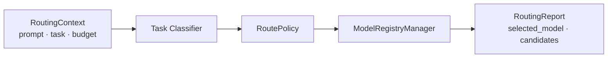

---

## 5. RAG Pipeline

RAG 子系统实现 **企业文档入库 → 向量检索 → 上下文注入 → LLM 生成 → 来源引用** 的完整闭环。

### 5.1 Pipeline 架构

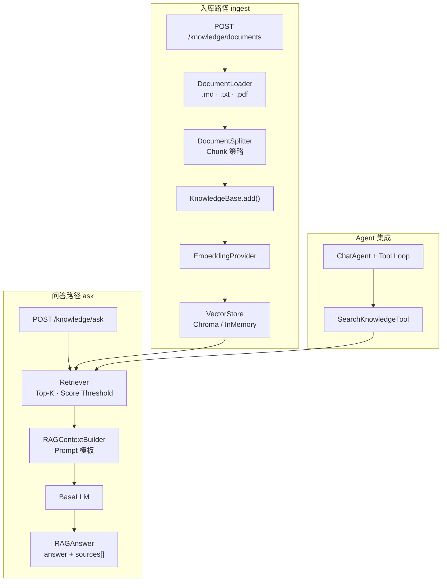

### 5.2 核心类

| 类 | 路径 | 职责 |
|----|------|------|
| `RAGPipeline` | `app/rag/pipeline.py` | 统一入口：`ingest_file()` · `ask()` |
| `KnowledgeBase` | `app/rag/knowledge_base.py` | Chunk 写入与检索 facade |
| `Retriever` | `app/rag/retriever.py` | 相似度检索 + 分数过滤 |
| `RAGContextBuilder` | `app/rag/context_builder.py` | 检索结果 → LLM Prompt |
| `SearchKnowledgeTool` | `app/tools/knowledge_tool.py` | Agent Tool 形式暴露 RAG |

### 5.3 配置项

```env
EMBEDDING_PROVIDER=fake          # fake | local | openai
VECTOR_STORE_PROVIDER=memory     # memory | chroma
ENABLE_KNOWLEDGE_TOOL=true
KNOWLEDGE_UPLOAD_DIR=./data/knowledge_uploads
```

---

## 6. Model Serving

模型 Serving 层描述 **推理服务如何部署、暴露与扩展**。

### 6.1 Serving 拓扑

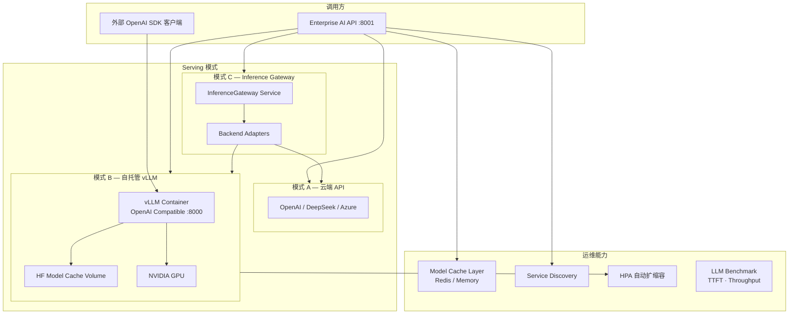

### 6.2 vLLM Serving 要点

| 项 | 说明 |
|----|------|
| 镜像 | `vllm/vllm-openai`（Compose / K8s 清单内置） |
| 协议 | OpenAI Compatible REST（`/v1/chat/completions`） |
| 平台对接 | `VLLMProvider` → `VLLM_ENDPOINT=http://llm:8000/v1` |
| 调优 | `VLLM_MAX_LEN` · `VLLM_GPU_UTIL` · `--enforce-eager` 等 |
| 基准 | `backend/benchmark/` — Qwen / vLLM / OpenAI 对比报告 |

### 6.3 Gateway Serving 要点

`InferenceGateway` 在 Provider 之上提供：

- 统一 `request_id` 与结构化请求/响应日志
- Token 用量统计（`get_token_stats()`）
- 多后端适配（OpenAI 兼容、vLLM、SGLang、TGI）
- 异常映射与可观测性钩子

启用方式：`ENABLE_INFERENCE_GATEWAY=true` 或 `MODEL_PROVIDER=gateway`

---

## 7. Data Flow

### 7.1 对话请求数据流

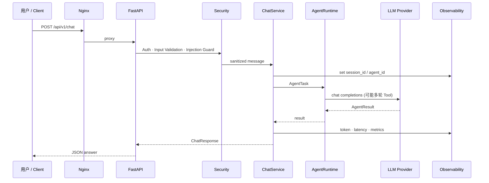

### 7.2 知识问答数据流

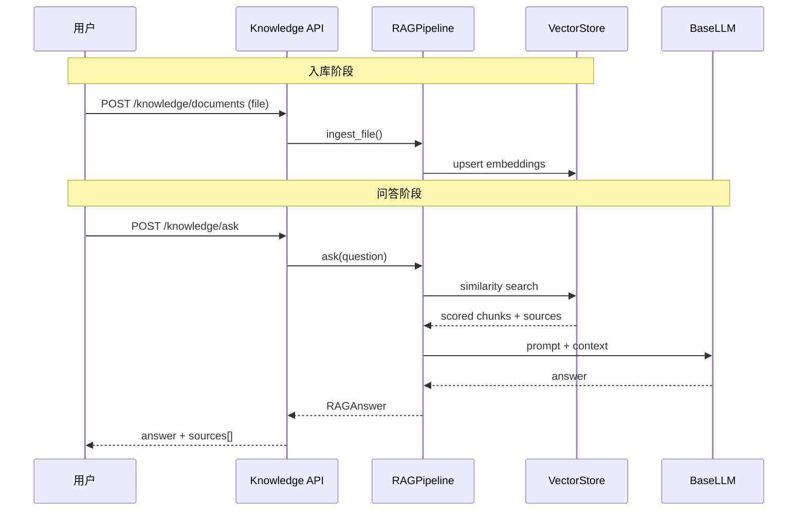

### 7.3 Software Team 全链路数据流（摘要）

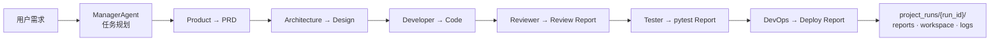

详细角色、Tool 约束与 Demo 命令见 [software_team.md](./software_team.md)。

### 7.4 可观测性数据流

| 信号 | 产生位置 | 消费 |
|------|----------|------|
| 结构化 JSON 日志 | `observability/logging/` | ELK / Loki |
| Prometheus 指标 | `app/monitoring/` · `/metrics` | Grafana |
| Agent Trace | `app/agents/executor/tracer.py` | Dashboard / Debug |
| Gateway Token | `app/gateway/stats.py` | Infra Dashboard |

---

## 8. Deployment Architecture

平台支持 **轻量开发栈**、**生产 Compose 全栈** 与 **Kubernetes 企业部署** 三档拓扑。

### 8.1 部署模式对比

| 模式 | 路径 | 组件 | 适用场景 |
|------|------|------|----------|
| 本地开发 | `backend/` + uvicorn | API only | 日常开发、单元测试 |
| 轻量 Docker | `infra/docker/` | API ± vLLM | Swagger Demo、无 GPU 仅 API |
| 生产 Compose | `infra/deploy/` | Nginx + API + Agent + vLLM + Chroma + Redis | 单机 / 小集群生产 |
| Kubernetes | `infra/k8s/` | Deployment + Ingress + HPA + PVC | 企业 K8s 集群 |

### 8.2 生产 Compose 拓扑

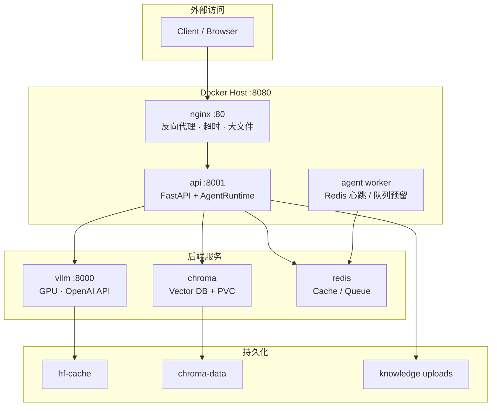

> Agent 推理主路径在 **API 进程**内同步执行；`agent` Worker 用于企业化拆分与后续水平扩展。

### 8.3 Kubernetes 拓扑

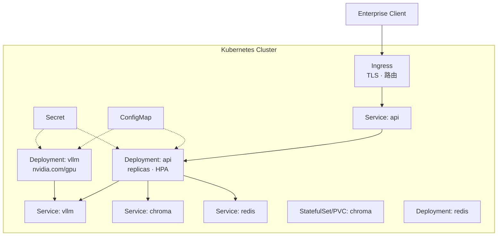

清单目录：`infra/k8s/`（namespace · configmap · secret · api · vllm · chroma · redis · ingress · hpa · kustomization）

### 8.4 CI/CD 与镜像

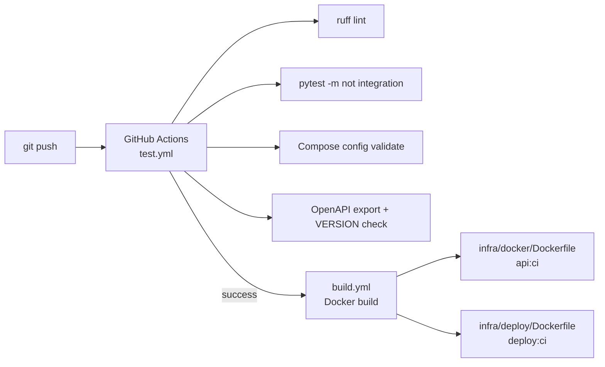

| 镜像 | Dockerfile | 用途 |
|------|------------|------|
| 开发 / 轻量 API | `infra/docker/Dockerfile` | API + Canonical 包 |
| 生产 API | `infra/deploy/Dockerfile` | API + knowledge 依赖 + Redis |

### 8.5 环境变量分层

```text
┌─────────────────────────────────────────┐
│  .env / ConfigMap / Secret              │
│  MODEL_PROVIDER · API_KEY · VLLM_*      │
│  EMBEDDING_PROVIDER · VECTOR_STORE_*  │
│  ENABLE_API_AUTH · ENABLE_*_GUARD      │
└─────────────────┬───────────────────────┘
                  ▼
┌─────────────────────────────────────────┐
│  app/config/settings.py (Pydantic)       │
└─────────────────┬───────────────────────┘
                  ▼
┌──────────────┐  ┌──────────────┐  ┌──────────────┐
│ AgentConfig  │  │ LLM Factory  │  │ RAG Pipeline │
└──────────────┘  └──────────────┘  └──────────────┘
```

---

## 相关文档

| 文档 | 说明 |
|------|------|
| [STRUCTURE.md](./STRUCTURE.md) | 目录结构与 Canonical / Legacy 映射 |
| [software_team.md](./software_team.md) | AI 软件团队 Agent 与应用层 Demo |
| [production_deploy.md](./production_deploy.md) | 生产 Compose 启动与运维 |
| [deployment.md](./deployment.md) | 轻量 Docker 栈 |
| [vllm_deployment.md](./vllm_deployment.md) | vLLM 安装与联调 |
| [infra/k8s/README.md](../infra/k8s/README.md) | Kubernetes 部署步骤 |
| [API.md](./API.md) | REST API 参考 |

---

<p align="center"><sub>Enterprise AI Platform Architecture · v1.0.0</sub></p>
