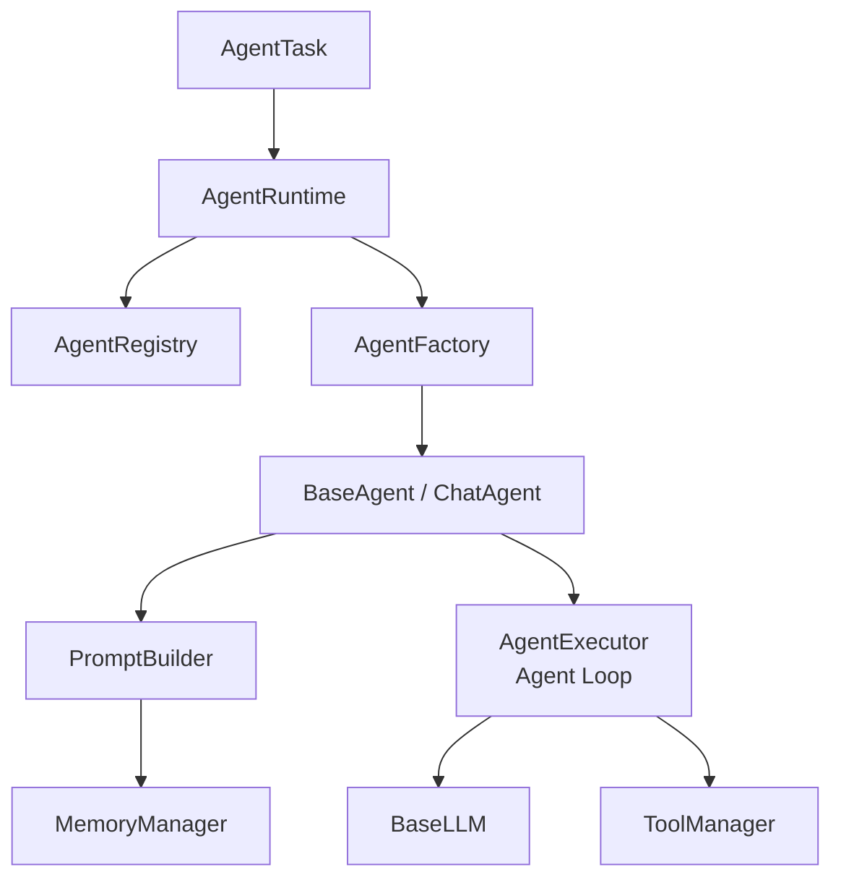

# Agent 架构设计：从对话脚本到企业级运行时

> Enterprise AI Platform · Phase 1 核心设计  
> 相关代码：`core/agent` · `backend/app/agents/` · [系统架构](../architecture.md)

---

## 背景

企业接入大模型时，常见起点是一个「调用 OpenAI API + 拼 Prompt」的脚本。随着场景增多——Tool Calling、多轮记忆、角色切换、可观测性——脚本会迅速膨胀为难以测试、难以复用的「面条代码」。

**Enterprise AI Platform** 在 Phase 1 将 Agent 能力抽象为 **可注册、可调度、可测试** 的运行时框架，使上层应用（知识助手、软件团队、Workflow）共享同一套执行内核，而不是各自实现 LLM 循环。

---

## 问题

在框架化之前，团队通常面临四类痛点：

| 痛点 | 表现 |
|------|------|
| **耦合 LLM 供应商** | 业务代码直接 `openai.chat.completions`，切换 vLLM / 本地模型需大面积改动 |
| **Prompt 散落** | System Prompt 硬编码在 Agent 类中，版本管理与 A/B 困难 |
| **Tool 执行不一致** | 有的 Agent 解析 JSON，有的靠正则，Observation 格式不统一 |
| **无法统一调度** | Multi-Agent、Workflow、REST API 各自 `new ChatAgent()`，缺会话与注册机制 |

此外，Agent Loop（LLM → Tool → Observation → LLM）若与「计划」「工作流」缠在一起，会导致单测必须启动完整链路，CI 成本高。

---

## 方案

平台采用 **分层 Agent 架构**，核心思路：



**设计原则：**

1. **Agent 只依赖 `BaseLLM`**，通过 Factory 选择 Provider（OpenAI / vLLM / Gateway）。
2. **Prompt 外置**：`PromptBuilder` + `templates/`，禁止在 Agent 内写长 System Prompt。
3. **Loop 单一职责**：`AgentExecutor` 只负责 LLM ↔ Tool 循环；Plan / DAG 由上层 Workflow 编排。
4. **注册 + 工厂**：新 Agent 类型注册到 `AgentRegistry`，运行时按名称实例化。
5. **统一任务模型**：`AgentTask`（session_id、message、history、metadata）作为 API / Workflow / Multi-Agent 的公共输入。

Canonical 导入（Task 9.1）：

```python
from core.agent import AgentRuntime, ChatAgent, AgentTask
# Legacy 仍可用：from app.agents import ...
```

---

## 实现

### 1. AgentRuntime — 调度入口

`AgentRuntime` 接收 `AgentTask`，解析 Agent 名称（默认 `chat`），经 Factory 创建实例并调用 `run()`：

```python
# backend/app/agents/runtime.py（概念摘要）
@dataclass
class AgentTask:
    session_id: str
    user_message: str
    agent_name: str = ""
    history: list[MemoryRecord] = field(default_factory=list)
    metadata: dict[str, Any] = field(default_factory=dict)

class AgentRuntime:
    DEFAULT_AGENT = "chat"
    def run(self, task: AgentTask, *, config: AgentConfig | None = None) -> AgentResult:
        ...
```

REST 层 `ChatService` 将 HTTP 请求转为 `AgentTask`，再交给 `default_runtime`。

### 2. AgentExecutor — ReAct 循环

`AgentExecutor` 驱动标准 Tool-Augmented 循环：

```text
messages = PromptBuilder.build()
loop (max MAX_AGENT_LOOP):
    result = LLM.chat(messages, tool_schemas)
    if tool_calls:
        observation = ToolManager.execute(...)
        append tool + observation to messages
    else:
        return final answer
```

关键模块：

| 模块 | 路径 | 职责 |
|------|------|------|
| `AgentExecutor` | `app/agents/executor/agent_executor.py` | Loop 主逻辑 |
| `ToolMessageBuilder` | `executor/tool_message_builder.py` | Tool Call / Observation 消息格式 |
| `AgentTracer` | `executor/tracer.py` | 链路追踪 |
| `AgentErrorHandler` | `executor/error_handler.py` | Tool 失败重试与降级 |

### 3. ChatAgent — 默认对话 Agent

`ChatAgent` 组合 PromptBuilder、Memory、ToolManager、可选 Planner（Plan-and-Execute），并实现 Multi-Agent 的 `Agent` 接口（`can_handle` / `get_capabilities`）。

配置通过 `AgentConfig.from_env()` 读取 `MAX_AGENT_LOOP`、`ENABLE_MCP` 等，与 `Settings` 解耦。

### 4. 可测试性

平台提供 Mock LLM 与 Echo Agent，248+ pytest 覆盖 Runtime / Executor / Tool 路径。Demo 亦支持离线 Mock：

```powershell
python examples/demo_03_agent.py   # Mock Tool Calling，无需 API Key
```

---

## 总结

Enterprise AI Platform 的 Agent 架构将 **调度（Runtime）**、**执行（Executor）**、**角色（Agent 实现）**、**Prompt/Memory/Tool** 四层分离，解决了 LLM 供应商耦合与 Loop 重复实现的问题。

对开发者：新增 Agent 只需继承 `BaseAgent`、注册到 `AgentRegistry`、提供 Prompt 模板。  
对企业：统一 Runtime 便于接入认证、日志、指标与 Workflow。  
对面试/开源展示：清晰的调用链与 Mock 测试体现工程化思维，而非 Demo 级脚本。

**延伸阅读：** [系统架构 · Agent Runtime](../architecture.md#2-agent-runtime) · [Demo 03 — Agent Tool Calling](../../examples/demo_03_agent.py)
