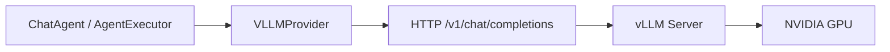

# vLLM 部署实践：从 GPU 服务器到 Platform 无缝对接

> Enterprise AI Platform · Phase 2  
> 相关文档：[vllm_deployment.md](../vllm_deployment.md) · [deployment.md](../deployment.md) · `infra/docker/`

---

## 背景

企业部署大模型应用时，**数据合规**与**成本**往往要求推理服务私有化。vLLM 提供高性能、OpenAI 兼容的 HTTP API，是自建推理层的主流选择。

本平台在 Phase 2 完成 vLLM 部署脚本、`VLLMProvider` 对接、Docker Compose 全栈与性能基准（Task 2.4–2.7），使 Agent 层 **零改动** 即可从云端 API 切换到自托管 vLLM。

---

## 问题

自托管 vLLM 在实践中常见以下难题：

| 问题 | 影响 |
|------|------|
| **显存不足** | 7B 全精度模型在 4GB 显卡上 OOM |
| **网络隔离** | Docker 容器访问 WSL 内 vLLM 的 IP/端口不通 |
| **接口不一致** | 各框架自建 HTTP 客户端，Tool Calling 参数不兼容 |
| **运维复杂** | 开发用脚本启动，生产缺 Compose/K8s 与健康检查 |
| **性能未知** | 缺少 TTFT、吞吐、显存占用的可复现基准 |

若 Platform 与 vLLM 强耦合，每次调整部署方式都要改 Agent 代码，违背 Provider 抽象原则。

---

## 方案

整体策略：**vLLM 作为独立推理服务，Platform 通过 OpenAI 兼容 Provider 接入**。



**三层部署模式：**

| 模式 | 路径 | 适用 |
|------|------|------|
| 本地脚本 | `backend/scripts/start_vllm_server.sh` | WSL / Linux 开发 |
| 轻量 Compose | `infra/docker/docker-compose.yml` | API + vLLM 两容器 |
| 生产 Compose | `infra/deploy/docker-compose.yml` | Nginx + API + vLLM + Chroma + Redis |
| Kubernetes | `infra/k8s/vllm.yaml` | 企业集群 + GPU 调度 + HPA |

配置切换仅需 `.env`：

```env
MODEL_PROVIDER=vllm
VLLM_ENDPOINT=http://127.0.0.1:8000/v1
VLLM_API_KEY=EMPTY
MODEL_NAME=Qwen2.5
VLLM_MAX_TOKENS=256
```

---

## 实现

### 1. vLLM 服务启动（小显存友好）

默认模型 `Qwen/Qwen2.5-0.5B-Instruct`，约 1GB 显存，适合 RTX 2050 4GB：

```bash
# backend/scripts/start_vllm_server.sh（要点）
vllm serve Qwen/Qwen2.5-0.5B-Instruct \
  --host 0.0.0.0 --port 8000 \
  --max-model-len 512 \
  --gpu-memory-utilization 0.65 \
  --enforce-eager
```

`--enforce-eager` 降低编译开销，便于开发机稳定启动；生产可按 [vllm_performance_tuning.md](../vllm_performance_tuning.md) 调优。

### 2. VLLMProvider 对接

`app/llm/vllm_provider.py` 继承 OpenAI SDK 兼容客户端，读取 `VLLM_ENDPOINT` / `VLLM_MAX_TOKENS`，与 `OpenAIProvider` 共享 `BaseLLM.chat()` 接口。Agent 通过 `get_llm_client()` 自动获得 vLLM 实例。

### 3. Docker Compose 编排

`infra/docker/docker-compose.yml` 定义：

- **llm** 服务：`vllm/vllm-openai` 镜像，`gpus: all`，HF 缓存 Volume
- **backend** 服务：依赖 `llm` 健康检查，`VLLM_ENDPOINT=http://llm:8000/v1`

无 GPU 环境可使用 `docker-compose.api-only.yml` 仅启动 API（Mock / 云端 API）。

### 4. 联调与基准

```bash
cd backend
python scripts/test_vllm_integration.py --live   # 或 --mock-client 离线
python -m benchmark.latency_test --backend vllm
python -m benchmark.generate_report
```

参考数据（RTX 2050 4GB · Qwen2.5-0.5B）：TTFT p50 ≈ 69ms，生成约 23 tokens/s（见 [performance.md](../performance.md)）。

### 5. 常见坑：Docker ↔ WSL 网络

Windows Docker 容器默认无法访问 WSL 内 `192.168.x.x:8000`。可选方案：

1. API 与 vLLM 均在 WSL 内 uvicorn / vllm 启动（推荐联调）
2. WSL `networkingMode=mirrored` 后重建 WSL
3. 生产栈在同一 Compose 网络内，使用服务名 `llm:8000`

---

## 总结

vLLM 部署实践的核心是 **推理与应用解耦**：vLLM 专注 GPU 推理，Platform 专注 Agent / RAG / Workflow。通过 `VLLMProvider` + 统一配置，开发、Compose、K8s 三环境可用同一套 Agent 代码。

建议路径：本地脚本验证 → Compose 全栈 → 基准报告 → K8s 生产。  
无 GPU 时仍可用 Mock Demo 或 `MODEL_PROVIDER=openai` 完成业务开发，GPU 就绪后仅改 `.env`。

**延伸阅读：** [vLLM 部署指南](../vllm_deployment.md) · [Demo 01/02 Live 模式](../../examples/README.md)
