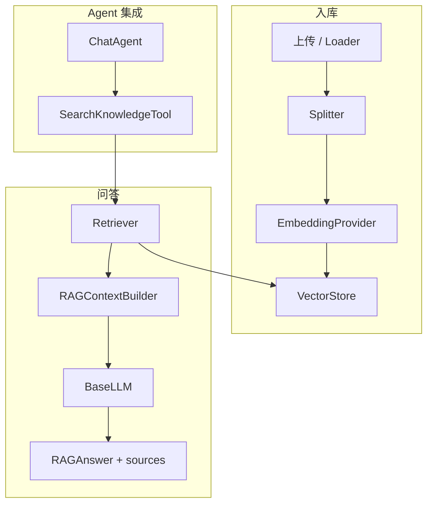

# RAG 系统设计：企业知识库从入库到 Agent 检索

> Enterprise AI Platform · Phase 3  
> 相关代码：`knowledge/rag` · `backend/app/rag/` · [企业知识助手 Demo](../../examples/enterprise_knowledge_assistant/README.md)

---

## 背景

大模型擅长通用推理，但对 **企业私有文档**（制度、产品手册、接口说明）容易幻觉。RAG（Retrieval-Augmented Generation）通过「检索相关片段 → 注入 Prompt → 生成答案」将回答锚定在可验证来源上。

本平台 Phase 3 交付完整 RAG Pipeline、REST API（`/api/v1/knowledge`）、`SearchKnowledgeTool`（供 Agent Tool Calling）及离线 Demo，支持 Fake Embedding 开发、Chroma 生产持久化。

---

## 问题

企业 RAG 落地常见挑战：

| 问题 | 说明 |
|------|------|
| **链路割裂** | 上传、分块、向量化、检索、生成分散在不同脚本，难以维护 |
| **Embedding 依赖** | 开发环境强绑 GPU/API，CI 无法跑通 |
| **检索质量** | 仅 Top-K 相似度，无分数阈值与来源引用 |
| **与 Agent 重复** | 问答 API 一套逻辑，Chat Agent 又写一套检索 |
| **向量库切换** | 内存 / Chroma / 未来 Milvus 若硬编码，迁移成本高 |

设计目标：**单一 `RAGPipeline` 门面**，业务与 Agent 均通过它访问知识能力。

---

## 方案



**模块职责：**

| 组件 | 职责 |
|------|------|
| `DocumentLoader` | 解析 TXT / MD / PDF / DOCX |
| `DocumentSplitter` | 按段落/长度分块 |
| `EmbeddingProvider` | Fake / Local / OpenAI 可切换 |
| `VectorStore` | InMemory（开发）· Chroma（生产） |
| `Retriever` | Top-K + score_threshold |
| `RAGContextBuilder` | 检索结果 → 结构化 Prompt |
| `RAGPipeline` | `ingest_file()` · `ask()` 统一入口 |

Canonical 导入：

```python
from knowledge.rag import RAGPipeline, create_rag_pipeline, ask
```

---

## 实现

### 1. 入库流程

```python
# backend/app/rag/pipeline.py（概念）
def ingest_file(self, path, *, extra_metadata=None) -> int:
    document = self._loader.load(path, extra_metadata=extra_metadata)
    chunks = self._splitter.split(document)
    return self._kb.add_chunks(chunks)  # Embedding → VectorStore
```

REST：`POST /api/v1/knowledge/documents` 接收 multipart 文件，写入 `KNOWLEDGE_UPLOAD_DIR` 后调用 `ingest_file()`。

### 2. 问答流程

```python
def ask(self, question: str) -> RAGAnswer:
    scored = self._retriever.retrieve(question, top_k=self._top_k, ...)
    messages = self._context_builder.build(question, scored)
    result = self._llm.chat(messages, use_tools=False)
    return RAGAnswer(answer=result.content, sources=...)
```

`RAGAnswer.sources` 携带 `document_id`、分数、片段预览，前端/API 可展示引用。

### 3. 配置驱动

```env
EMBEDDING_PROVIDER=fake          # 开发/CI
VECTOR_STORE_PROVIDER=memory     # 或 chroma
ENABLE_KNOWLEDGE_TOOL=true
KNOWLEDGE_UPLOAD_DIR=./data/knowledge_uploads
```

生产建议：`EMBEDDING_PROVIDER=local|openai` + `VECTOR_STORE_PROVIDER=chroma`，Compose 栈见 `deploy/docker-compose.yml` 中的 `chroma` 服务。

### 4. Agent Tool 集成

`SearchKnowledgeTool` 注册到 `ToolRegistry`，ChatAgent 在 Agent Loop 中可主动调用检索。Tool 内部委托 `RAGPipeline`，避免双份检索逻辑。

### 5. 离线 Demo

```powershell
python examples/demo_02_rag.py
```

使用 `FakeEmbedding` + InMemory + `DemoRAGLLM`，无需 API Key 即可演示入库、检索、带来源的答案。

---

## 总结

本平台 RAG 设计强调 **Pipeline 门面 + Provider 抽象 + 来源可追溯**。开发用 Fake/Memory 保证 CI 与 Demo；生产切换 Embedding 与 Chroma 仅改配置。

与 Agent 的关系：RAG 既可独立 REST 问答，也可作为 Tool 嵌入对话，适合「企业知识助手 + 通用 Chat」并存的产品形态。

**延伸阅读：** [架构 · RAG Pipeline](../architecture.md#5-rag-pipeline) · [Demo 02](../../examples/demo_02_rag.py)
