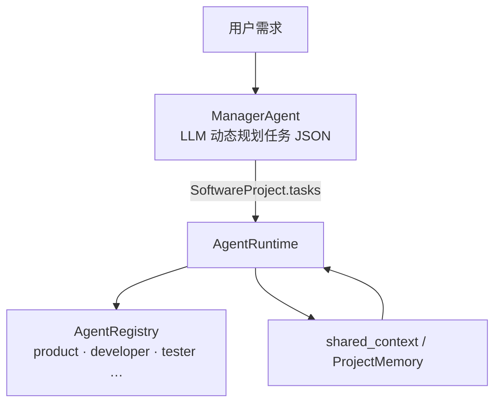

# Multi-Agent 协作：从单 Agent 到角色化团队

> Enterprise AI Platform · Phase 3 / 5  
> 相关代码：`app/agents/software_team/` · `app/multi_agent/` · `app/memory/shared_memory.py`

---

## 背景

单一 ChatAgent 适合问答与轻量 Tool 场景；复杂任务（写 PRD、改代码、跑测试）需要 **不同专长、不同 Prompt、不同 Tool 权限** 的多个 Agent 协作。Multi-Agent 不是「多开几个 ChatGPT 窗口」，而是 **统一运行时下的角色注册、任务分配与上下文共享**。

本平台通过 `AgentRegistry` 注册专家 Agent、Manager 动态规划任务、`shared_context` / `ProjectMemory` 传递中间产物，并与 Workflow Engine 结合支持人工审批节点。

---

## 问题

Multi-Agent 实践中的典型失败模式：

| 问题 | 后果 |
|------|------|
| **硬编码流水线** | 固定 PM→Dev→Test 顺序，无法按需求裁剪 |
| **LLM 假执行** | 模型在回复里「假装写文件/跑命令」，产物不可信 |
| **上下文爆炸** | 每 Agent 全量历史，Token 成本与干扰剧增 |
| **接口不统一** | 各 Agent 自定义 `run()` 签名，Workflow 难以编排 |
| **无法单测** | 必须联调真实 LLM 才能验证协作逻辑 |

企业还需要 **可审计**：谁（哪个 Agent）在什么阶段产出了什么。

---

## 方案



**核心机制：**

1. **Manager 规划，Runtime 执行** — Manager 输出 `SoftwareProject` 与任务列表，可选 `execute_tasks` 逐项调度。
2. **角色 Agent 注册** — `product`、`architecture`、`developer` 等注册到同一 Registry，与 `chat` 并列。
3. **Tool 强制落地** — Developer/Tester/DevOps 的文件与 shell **必须经 Tool**，禁止纯文本「伪执行」。
4. **Multi-Agent 接口** — `app/multi_agent/agent.py` 定义 `can_handle()` / `get_capabilities()`，与 `BaseAgent` 解耦。
5. **Workflow 编排** — DAG 将 Multi-Agent 阶段可视化，并支持 Human Approval。

---

## 实现

### 1. 角色注册

```python
# app/agents/__init__.py（摘要）
registry.register("product", ProductRequirementAgent)
registry.register("developer", DeveloperAgent)
registry.register("tester", TesterAgent)
# ...
```

各角色 Prompt 来自 `app/prompts/templates/software_team_*.txt`，禁止硬编码长指令。

### 2. Manager 动态规划

`ProjectManagerAgent` 向 LLM 请求 JSON 任务数组（fallback 为默认六步列表），生成 `SoftwareTask`：

```python
@dataclass
class SoftwareTask:
    id: str
    title: str
    description: str
    agent: str      # registry 中的名称
    status: str
    result: str = ""
```

### 3. 共享上下文

`AgentTask.shared_context` 与 `EnterpriseMemoryManager` 的 `ProjectMemory` 在阶段间传递 PRD、架构摘要、Diff 等，PromptBuilder 按角色注入必要片段而非全量历史。

### 4. Tool 边界（Developer 示例）

- `filesystem`：只读
- `code`：唯一写文件入口
- 检测到大段代码且无 Tool Call → 拒绝并提示使用 Tool

Tester 使用 `terminal` Tool 执行 pytest（Mock/模拟模式下可降级）。

### 5. Workflow 中的 Multi-Agent

`build_team_human_approval_workflow()` 定义：

```text
manager → developer → human_gate → reviewer → tester
```

`WorkflowExecutor` 对每个 Agent 节点构造 `AgentTask`，调用同一 `AgentRuntime`。

### 6. 离线验证

```powershell
python examples/demo_04_workflow.py   # Mock Runtime 多 Agent 节点
python examples/demo_05_software_team.py  # 全链路 Mock LLM + Tool Bootstrap
```

---

## 总结

本平台的 Multi-Agent 不是框架外的「多进程聊天」，而是 **Registry + Runtime + 共享 Memory + Tool 约束** 下的可测试协作模型。Manager 提供灵活性，Tool 提供可信度，Workflow 提供可控性与人工介入点。

适用场景：软件交付流水线、跨部门审批、专精 Agent（法务/财务/运维）编排。  
不适用：简单 FAQ——单 ChatAgent + RAG 即可，避免过度设计。

**延伸阅读：** [software_team.md](../software_team.md) · [架构 · Multi-Agent 扩展](../architecture.md#24-multi-agent-扩展)
