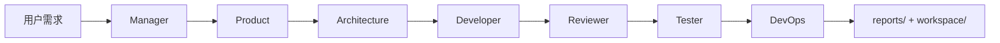

# AI Software Team 实现：从需求到可交付产物的七角色流水线

> Enterprise AI Platform · Phase 5 · Task 5.8  
> 相关代码：`applications/software_team/pipeline/` · `app/agents/software_team/`

---

## 背景

「用 AI 写代码」的 Demo 往往止步于一段 Markdown 或单个文件。**AI Software Team** 要模拟真实软件工程：**PM 拆任务 → 产品写 PRD → 架构设计 → 开发实现 → 审查 → 测试 → 部署**，且每步产出可落盘、可审计。

Phase 5 在平台层实现 7 类角色 Agent，应用层 `SoftwareTeamPipeline` 串联全链路，运行记录写入 `project_runs/`（或 Demo 的 `examples/_output/software_team/`）。

---

## 问题

端到端 AI 软件交付的核心难点：

| 问题 | 说明 |
|------|------|
| **阶段产物不可追溯** | 缺少 PRD、架构、Review Report 等结构化输出 |
| **开发不可验证** | LLM 声称「已创建文件」但磁盘无变化 |
| **测试不可重复** | 无统一 pytest 执行与报告格式 |
| **流水线僵化** | 所有项目走相同步骤，无法按需求增减 |
| **Demo 不可复现** | 无 run_id、logs、workspace 目录规范 |

团队还需要在 **无 API Key** 环境演示全链路（面试、CI、开源 Star）。

---

## 方案



**分层设计：**

| 层级 | 路径 | 职责 |
|------|------|------|
| 平台 Agent | `app/agents/software_team/` | 角色逻辑、Tool、Prompt |
| 应用 Pipeline | `applications/software_team/pipeline/` | 阶段编排、落盘 |
| Mock 客户端 | `pipeline/demo_clients.py` | 离线 Demo LLM |
| 运行记录 | `RunRecorder` | tasks.json · logs · reports · workspace |

**设计原则：**

- Manager **LLM 规划**任务，非硬编码六步（无 LLM 时 fallback）。
- Developer / Tester / DevOps **必须 Tool**。
- 各阶段可 **单独 Demo**，也可 `SoftwareTeamPipeline.run()` 一键执行。

---

## 实现

### 1. SoftwareTeamPipeline 七阶段

```python
# applications/software_team/pipeline/team_pipeline.py（流程摘要）
def run(self, requirement: str) -> Path:
    project = self._stage_manager(...)           # 01 Manager + Mock PM LLM
    prd = self._stage_runtime(agent="product", ...)
    arch = self._stage_runtime(agent="architecture", ...)
    dev_summary = self._stage_runtime(agent="developer", client=None, ...)  # Tool Bootstrap
    review = self._stage_runtime(agent="reviewer", ...)
    test_report = self._stage_runtime(agent="tester", ...)
    deploy_report = self._stage_runtime(agent="devops", metadata={"devops_simulate": True})
    return recorder.run_root
```

`client=None` 时 Developer/Reviewer/Tester 走 **Tool Bootstrap / 启发式**，无需真实 LLM 仍可产生 workspace 与报告。

### 2. 角色与产出

| 阶段 | Agent | 典型产出 |
|------|-------|----------|
| 01 | `project_manager` | `tasks.json` · 任务列表 |
| 02 | `product` | `reports/PRD.md` |
| 03 | `architecture` | `docs/architecture.md` |
| 04 | `developer` | `workspace/` 源码 · 变更历史 |
| 05 | `reviewer` | `REVIEW_REPORT.md` |
| 06 | `tester` | `TEST_REPORT.md` |
| 07 | `devops` | `DEPLOYMENT_REPORT.md` |

### 3. RunRecorder 目录规范

```text
{run_id}/
  tasks.json
  manifest.json
  logs/
  reports/
    PIPELINE_SUMMARY.md
    PRD.md · REVIEW_REPORT.md · ...
  workspace/
    docs/
    src/
    tests/
```

### 4. Mock Demo 运行

```powershell
python examples/demo_05_software_team.py
python examples/demo_05_software_team.py --requirement "开发博客系统"
```

使用 `UserManagementPMMockLLM` 等预置响应 + Developer Tool Bootstrap，**无需 GPU / API Key / Docker**，约 10–30 秒完成。

### 5. 全量 Live 运行

```powershell
cd backend
python -m applications.software_team.run_full_team_demo --requirement "开发用户管理系统"
```

需配置 `backend/.env` 中 LLM Provider；Developer 等阶段将使用真实 Agent Loop。

---

## 总结

AI Software Team 的价值在于 **工程化交付形态**：不是一次性生成代码，而是分角色、分 artifact、可审计的流水线。Platform 提供 Agent 与 Tool 能力，Application 层 Pipeline 定义企业场景编排。

对招聘与开源：Demo 05 可在离线环境完整演示；`project_runs/` 目录即「AI 团队一次 Sprint 的交付包」。  
下一步演进：与 Workflow 人工审批深度整合、Git 分支策略自动化、RAG 注入企业编码规范。

**延伸阅读：** [software_team.md](../software_team.md) · [Demo 05](../../examples/demo_05_software_team.py)
