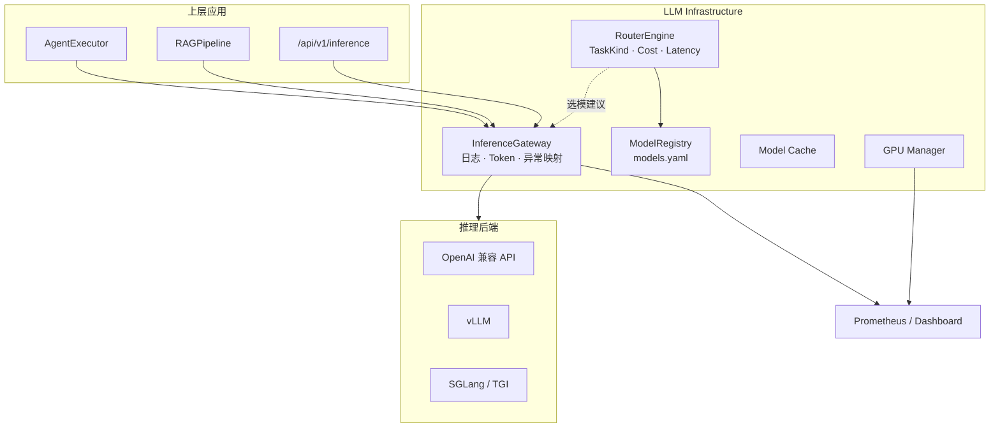

# LLM Infra 设计：Gateway、Model Router 与可观测推理层

> Enterprise AI Platform · Phase 7  
> 相关代码：`llm/gateway` · `llm/router` · `app/model_registry/` · `app/monitoring/`

---

## 背景

当 Agent、RAG、Workflow、Software Team 同时调用大模型时，企业面临新的基础设施问题：**多模型并存**、**成本与延迟权衡**、**Token 计量**、**后端切换（OpenAI / vLLM / SGLang）**、**GPU 与缓存监控**。

Phase 7 交付 **Inference Gateway**、**Model Registry**、**RouterEngine**、**Infra Dashboard** 与 Prometheus 指标，将「调 API」升级为「可治理的推理层」。

---

## 问题

缺少 LLM Infra 时常见症状：

| 问题 | 影响 |
|------|------|
| **模型选择硬编码** | 代码/PRD 用 GPT-4，代码补全也用同一模型，成本浪费 |
| **调用散落** | 各模块直连 OpenAI/vLLM，无法统一日志与限流 |
| **无 Token 账单** | 无法按项目/Agent/Workflow 分摊成本 |
| **后端切换困难** | 从 vLLM 迁到 SGLang 需改多处 HTTP 客户端 |
| **运维 blind spot** | GPU 利用率、Gateway 错误率、缓存命中率不可见 |

Agent 层应继续只依赖 `BaseLLM`，Infra 能力需在 Provider 之下或并行提供横切服务。

---

## 方案



**组件职责：**

| 组件 | 路径 | 职责 |
|------|------|------|
| Model Registry | `app/model_registry/` | 模型元数据：Vendor、Cost、Context、Capability |
| RouterEngine | `app/router/engine.py` | 按 TaskKind 选模（CHAT/CODE/MATH/LONG_CONTEXT） |
| InferenceGateway | `app/gateway/service.py` | 统一 chat、request_id、Token 统计 |
| GatewayLLMProvider | `app/gateway/provider.py` | 对 Agent 暴露为 `BaseLLM` |
| Infra Dashboard | `app/dashboard/` | GPU、Gateway、缓存、调度概览 |
| Metrics | `app/monitoring/` | `/metrics` Prometheus |

---

## 实现

### 1. Model Registry

`app/model_registry/data/models.yaml` 定义模型条目，`ModelRegistryManager` 加载并提供查询 API。REST：`/api/v1/models/registry`。

### 2. RouterEngine

```python
# 概念用法
report = engine.route(RoutingContext(prompt="请用 Python 实现快排"))
# report.task_type == TaskKind.CODE
# report.selected_registry_name == "deepseek-coder"
```

分类器结合 Prompt 关键词、长度（长上下文阈值默认 6000）、显式 `task` 参数；`RoutePolicy` 配置 Cost/Latency 权重。

Demo 06 离线演示四种场景 + 显式 CODE 任务：

```powershell
python examples/demo_06_infra.py
```

### 3. Inference Gateway

```python
gateway = InferenceGateway(backend=backend, backend_kind=InferenceBackendKind.VLLM)
payload = gateway.chat(messages, use_tools=True)
# payload.result · payload.meta · Token 写入 stats
```

特性：

- 每次请求 `request_id` + 结构化日志（`gateway.request` / `gateway.response`）
- `get_token_stats()` 按 backend 聚合
- 异常映射为 `GatewayError` 统一处理

启用 Gateway 作为 Agent Provider：

```env
ENABLE_INFERENCE_GATEWAY=true
MODEL_PROVIDER=gateway
INFERENCE_BACKEND=vllm
```

### 4. Service Discovery & Cache（扩展）

`app/service/` 支持推理端点发现；`app/cache/` 提供模型响应缓存层（Redis / Memory），与 Gateway 配合降低重复 Prompt 成本。

### 5. 可观测性

- **Prometheus**：`infra_metrics` 收集 GPU 快照、请求计数
- **Dashboard**：`GET /api/v1/infra/dashboard/overview` · Demo 页 `/infra/dashboard/demo`
- **结构化日志**（Phase 8）：Request/Agent/Workflow ID 与 Token、Latency 字段

### 6. 部署拓扑

生产 Compose / K8s 中 **vLLM** 与 **API** 分离部署，Gateway 在 API 进程内统一出口；HPA 可对 API 与 vLLM 分别扩缩容（见 `infra/k8s/hpa.yaml`）。

---

## 总结

LLM Infra 层解决的是 **「多模型、多后端、可计量、可观测」**，而非替代 Agent 业务逻辑。Registry + Router 负责「选谁」，Gateway 负责「怎么调、怎么记」，Dashboard + Metrics 负责「跑得怎样」。

对开发者：继续 `get_llm_client()`，通过 `.env` 切换 openai / vllm / gateway。  
对企业：Token 统计与路由策略是成本治理的基础；Gateway 日志是审计与排障的基础。

**延伸阅读：** [架构 · LLM Infrastructure](../architecture.md#4-llm-infrastructure) · [Demo 06](../../examples/demo_06_infra.py) · [performance.md](../performance.md)
