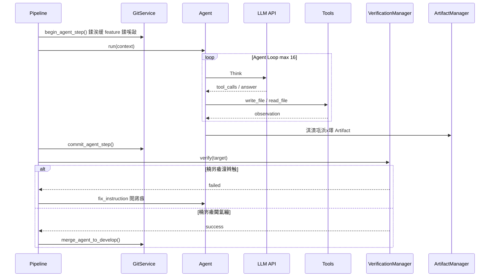
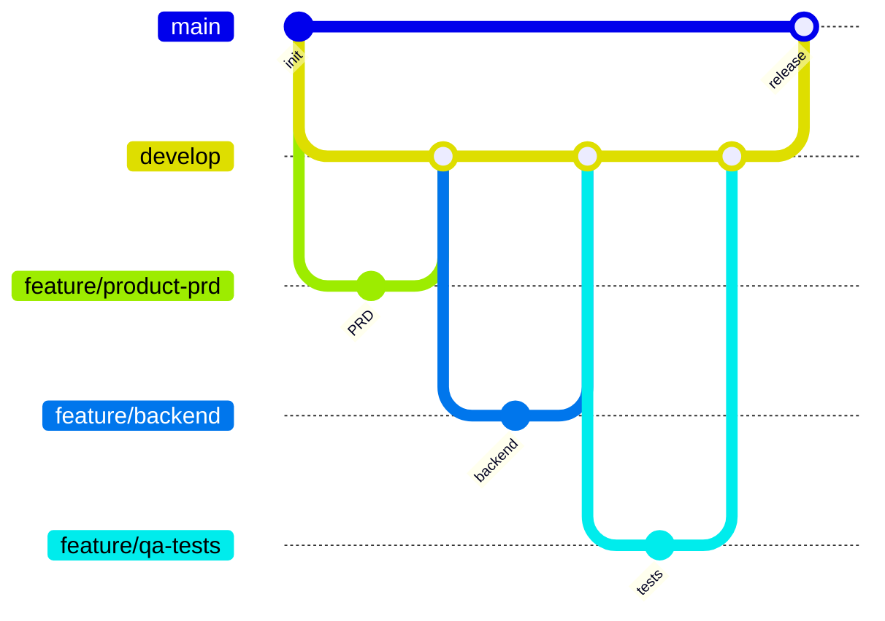
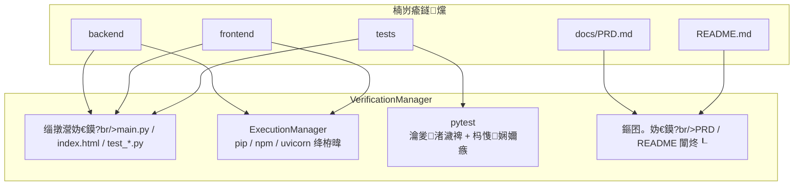

# Enterprise AI Agent 鈥?绯荤粺鏋舵瀯鍥?
> 浼佷笟绾?AI 杞欢鍥㈤槦骞冲彴锛氫粠鑷劧璇█闇€姹傚埌鍙繍琛岄」鐩骇鐗╃殑绔埌绔氦浠樸€?
---

## 1. 鎬讳綋鏋舵瀯

```mermaid
flowchart TB
    subgraph User["鐢ㄦ埛灞?]
        U1[Dashboard 娴忚鍣?br/>Vue3 + Vite]
        U2[CLI 鑴氭湰<br/>run_single_project.py]
    end

    subgraph Platform["骞冲彴灞?backend/app + applications/platform"]
        EC[EnterpriseCoordinator<br/>浼佷笟鍗忚皟鍣╙
        GM[Governance / Config<br/>娌荤悊涓庨厤缃甝
        PR[ProjectRegistry<br/>椤圭洰娉ㄥ唽]
    end

    subgraph Dashboard["Dashboard 灞?applications/dashboard"]
        DS[DashboardService]
        RS[RunService]
        EB[EventBus / WebSocket]
    end

    subgraph Team["Software Team 灞?applications/software_team"]
        STC[SoftwareTeamCoordinator]
        PL[Pipeline<br/>娴佹按绾跨紪鎺抅
        VM[VerificationManager<br/>楠岃瘉]
        EM[ExecutionManager<br/>鎵ц]
        GS[GitService<br/>Git 宸ヤ綔娴乚
        DS2[DeploymentService<br/>閮ㄧ讲璇勪及]
    end

    subgraph Agents["澶?Agent 鍗忎綔"]
        A1[ProductAgent]
        A2[ArchitectAgent]
        A3[BackendAgent]
        A4[FrontendAgent]
        A5[QAAgent]
        A6[DocumentationAgent]
    end

    subgraph Runtime["杩愯鏃?]
        LLM[LLM API<br/>DeepSeek / OpenAI 鍏煎]
        TM[ToolManager<br/>write_file / read_file]
        MM[MemoryManager]
    end

    subgraph Output["浜х墿 workspace/"]
        WS[docs/ PRD + Architecture]
        BE[backend/ FastAPI]
        FE[frontend/ 闈欐€?Vue]
        TS[tests/ pytest]
        GIT[.git feature鈫抎evelop鈫抦ain]
    end

    U1 --> DS
    U2 --> EC
    DS --> RS --> EC
    EC --> GM
    EC --> PR
    EC --> STC
    STC --> PL
    PL --> Agents
    Agents --> LLM
    Agents --> TM
    PL --> VM
    PL --> EM
    PL --> GS
    PL --> DS2
    TM --> Output
    GS --> GIT
    EB -.-> U1
```

---

## 2. Agent 娴佹按绾?
```mermaid
flowchart LR
    REQ[鐢ㄦ埛闇€姹俔 --> P1

    subgraph Pipeline["鍥哄畾娴佹按绾块『搴?]
        P1[ProductAgent<br/>docs/PRD.md]
        P2[ArchitectAgent<br/>docs/Architecture.md]
        P3[BackendAgent<br/>backend/]
        P4[FrontendAgent<br/>frontend/]
        P5[QAAgent<br/>tests/]
        P6[DocumentationAgent<br/>README.md]
    end

    P1 --> P2 --> P3 --> P4 --> P5 --> P6

    P6 --> V{VerificationManager<br/>缁撴瀯 / pytest / 鏂囨。}
    V -->|澶辫触| R[RetryPolicy<br/>鏈€澶?3 娆
    R --> Pipeline
    V -->|閫氳繃| G[GitService<br/>merge to develop]
    G --> M[merge develop 鈫?main]
    M --> D[Deployment 鍋ュ悍妫€鏌
    D --> DONE[浜や粯瀹屾垚]
```

---

## 3. 鍗?Agent 姝ラ鍐呴儴娴佺▼



---

## 4. Git 鍒嗘敮绛栫暐



姣忎釜 Agent 瀵瑰簲涓€鏉?`feature/<椤圭洰鍚?-<瑙掕壊>` 鍒嗘敮锛屽畬鎴愬悗鍚堝苟鍒?`develop`锛涙祦姘寸嚎缁撴潫鏃?`develop 鈫?main`銆?
---

## 5. 楠岃瘉涓庢墽琛?


---

## 6. Demo 閮ㄧ讲瑙嗗浘锛圧un13 鍥句功绯荤粺锛?
```mermaid
flowchart LR
    subgraph Demo["鏈湴婕旂ず"]
        B[uvicorn backend.main:app<br/>:8000]
        F[python -m http.server<br/>:5173]
        DB[(SQLite<br/>library.db)]
    end

    SW[Swagger /docs] --> B
    FE[index.html] --> F
    F -->|fetch API| B
    B --> DB

    subgraph API["鏍稿績 API"]
        API1[/api/books]
        API2[/api/readers]
        API3[/api/borrowings]
        API4[/api/stats]
    end

    B --> API
```

婕旂ず璺緞锛歚backend/workspace/library_p0_run13/`  
鎿嶄綔鎸囧崡锛氳鏍圭洰褰?[DEMO.md](../DEMO.md)

---

## 7. 鎶€鏈爤

| 灞傜骇 | 鎶€鏈?|
|------|------|
| 骞冲彴鍚庣 | Python 3.11+, FastAPI, Pydantic Settings |
| LLM | OpenAI 鍏煎 API锛圖eepSeek 绛夛級 |
| Dashboard | Vue 3, Vite, Element Plus, Pinia |
| 鐢熸垚鐗╁悗绔?| FastAPI, SQLAlchemy 2, SQLite |
| 娴嬭瘯 | pytest, httpx |
| 鐗堟湰鎺у埗 | Git锛坒eature / develop / main锛?|

---

## 8. 鍏抽敭鐩綍

```
enterprise-ai-agent/
鈹溾攢鈹€ backend/
鈹?  鈹溾攢鈹€ app/                          # 骞冲彴 FastAPI 鍏ュ彛
鈹?  鈹溾攢鈹€ applications/
鈹?  鈹?  鈹溾攢鈹€ platform/                 # EnterpriseCoordinator
鈹?  鈹?  鈹溾攢鈹€ dashboard/                # Dashboard 鏈嶅姟
鈹?  鈹?  鈹斺攢鈹€ software_team/            # 娴佹按绾挎牳蹇?鈹?  鈹溾攢鈹€ scripts/run_single_project.py
鈹?  鈹斺攢鈹€ workspace/library_p0_run13/   # Demo 鏍蜂緥
鈹溾攢鈹€ frontend/                         # Dashboard UI
鈹溾攢鈹€ docs/ARCHITECTURE.md              # 鏈枃妗?鈹溾攢鈹€ README.md
鈹斺攢鈹€ DEMO.md
```
